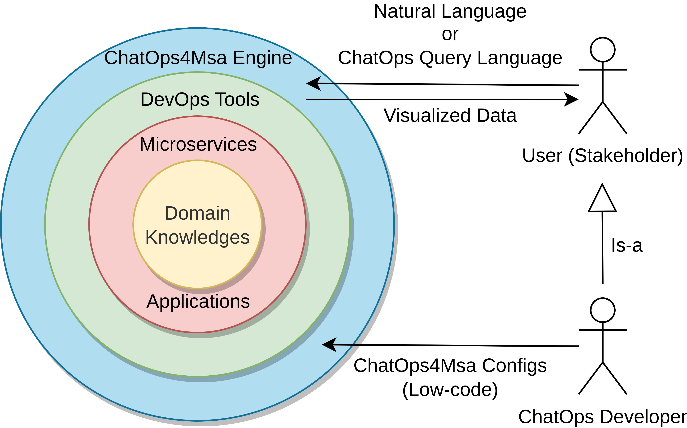
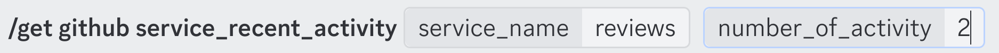
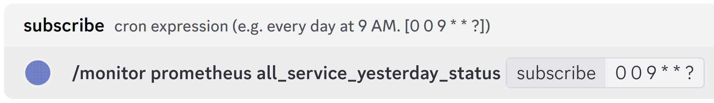
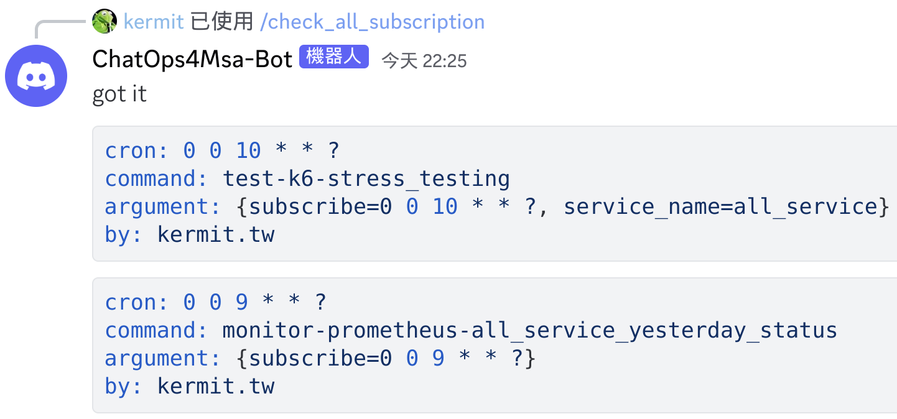
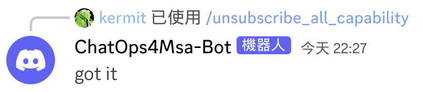

# ChatOps4Msa

> ChatOps for Microservices Architecture - ChatOps4Msa

ChatOps4Msa is a Conversational Assistant Tool designed for Microservices Development and Operations, utilizing Large Language Models (LLMs). Users can monitor real-time service status, perform automated actions like tests and code scanning, and receive alert notifications using a designed query language called CQL (ChatOps Query Language) or natural language.

Developers can customize desired functionalities using Low-code configuration files, which distinguishes it from traditional chatbot development that often requires extensive training data. Leveraging state-of-the-art Large Language Models, ChatOps4Msa analyzes user queries to determine intent and entities, enabling corresponding actions.

Here is the scenario of ChatOps4Msa:

<div></div>

<br />
<br />

Here is the operation concept of ChatOps4Msa:

<div></div>

_For more details, see [feature.md](./docs/feature.md)_

## How to Use

### Natural Language

In the chatops channel, use `@ChatOps4Msa-Bot` to mention ChatOps4Msa, then input your request in natural language.

<div></div>

### CQL (ChatOps Query Language)

In the chatops channel, directly execute commands using slash commands that start with `/`.

<div></div>

<br />
<br />

And here is the syntax of CQL:

```
/[ACTION] [TOOL] [COMMAND] [SERVICE] [FLAGS]
```

<div></div>

<br />
<br />

| PARAMETER | DESCRIPTION                                                                                                                                                                                                   | REQUIRED? |
| --------- | ------------------------------------------------------------------------------------------------------------------------------------------------------------------------------------------------------------- | --------- |
| [ACTION]  | The actions to be performed, such as retrieving information (get), configuring settings (set), monitoring services (monitor), testing services (test), and so on.                                             | required  |
| [TOOL]    | The tools to be used, such as GitHub, Prometheus, k6, custom modules, and so on.                                                                                                                              | required  |
| [COMMAND] | The operations to be executed, such as `service_recent_activity`.                                                                                                                                             | required  |
| [SERVICE] | The target service for execution, which can be selected as `all_service` to include all services.                                                                                                             | optional  |
| [FLAGS]   | Additional parameter options, which can be multiple; all CQL commands include the `subscribe` parameter for scheduling periodic executions of the function, with the parameter value being a Cron expression. | optional  |

## Try ChatOps4Msa

### Capabilities for Demo

Here are several demonstration capabilities designed to showcase the features of ChatOps4Msa, you can perform these capabilities using natural language or CQL.

| INTENT                                          | ENTITY                                   | DESCRIPTION                                                                                            |
| ----------------------------------------------- | ---------------------------------------- | ------------------------------------------------------------------------------------------------------ |
| get-example-echo_message                        | message                                  | Just echo a message to Discord.                                                                        |
| get-example-math_calculate                      | expression                               | Perform calculations using the given mathematical expression.                                          |
| get-github-service_recent_activity              | service_name, number_of_activity         | Retrieve recent activities of a service's repo.                                                        |
| get-github-service_past_week_team_activity      | service_name                             | Get the team's activity for the specified service within the past week.                                |
| get-github-service_code_scanning                | service_name                             | Get the check report of the newest commit in the service's repo.                                       |
| set-github-issue                                | service_name, issue_title, issue_message | Create issues in the repo of services with dependency risks.                                           |
| get-github-issue_progress_timeline              | service_name, number_of_issue            | Describe the progress of the issue with a timeline.                                                    |
| get-github-contribution_of_team_member          | service_name                             | Get the contribution analysis of team members.                                                         |
| monitor-prometheus-promql_overview              | `(null)`                                 | Monitor all service metrics using PromQL.                                                              |
| monitor-prometheus-grafana_overview             | `(null)`                                 | Monitor the overall status of all services using a graphical user interface (GUI).                     |
| get-prometheus-alert_rule                       | `(null)`                                 | View the alert rules through the Prometheus UI.                                                        |
| monitor-prometheus-service_health               | `(null)`                                 | Monitor the health status of all the services.                                                         |
| monitor-prometheus-all_service_yesterday_status | `(null)`                                 | Retrieve yesterday's microservice operational status using PromQL.                                     |
| monitor-prometheus-service_dependency           | `(null)`                                 | Monitor the dependency relationships between microservices.                                            |
| test-k6-stress_testing                          | service_name                             | Perform stress testing on a specific service.                                                          |
| test-k6-smoke_testing_all_service               | number_of_virtual_user                   | Perform smoke testing on all service.                                                                  |
| test-custom_test-smoke_and_repo_all_service     | number_of_virtual_user                   | Perform smoke tests on all services, monitor status and get recent activity for failing microservices. |

#### Subscribe to a capability for regular execution.

> For security reasons, the following capabilities can only be executed via slash commands and not through natural language.

Fill in the Cron expression into the `subscribe` parameter of CQL, for example:

<div></div>

You can use the slash command `/check_all_subscription` to view all subscriptions, for example:

<div></div>

And you can use the slash command `/unsubscribe_all_capability` to unsubscribe from all capabilities, for example:

<div></div>

### Video Demo

[YouTube Link](https://youtu.be/qaGt92-pk28)

### Online Demo

> We do check the health of the Discord Bot periodically. Nevertheless, we do not have high availability guarantee on the service. Feel free to open an issue if it becomes unavailable.

[Discord Link](https://discord.gg/4AmgTdankh)
 
### Deploy ChatOps4Msa Yourself

> The default account for DevOps tools is `admin`, and the default password is `soselab`.

1. create a Discord Application (Bot):
    - Please refer to the [step_for_DCBot](https://drive.google.com/drive/folders/1FzD0hnLN3weTTEJ5zOfrXmml8RZwRaHC?usp=sharing)
    - Assign roles to yourself: `Supervisor`, and `Team_Member`.

2. Register Slash Command (CQL):
    - `git clone https://github.com/sheng-kai-wang/ChatOps4Msa.git`
    - Create `application.properties` and `secret.yml` files, you can refer to the provided templates: [application-template.properties](./src/main/resources/application-template.properties) and [secret_template.yml](./src/main/resources/capability/secret_template.yml).
    - You can register directly by running it locally in an IDE like IntelliJ. Since the microservices and DevOps tools haven't been started yet, you might encounter error messages related to RabbitMQ connection issues. However, this won't impact the registration of the Slash Command.

3. Deploy to your server using the provided `.sh` script files:
    - Install openjdk17, mvn (maven), docker, tmux.
    - And just run `sh run_all.sh` to start the entire system.
    - Frequently used commands are scripted. To exit the tmux session, use `"Ctrl" + "b", then "d"`. You can re-enter the session with `tmux attach`.

4. Fork my 4 microservice repos to use the `/get-github-service_code_scanning` capability:
    - https://github.com/sheng-kai-wang/ChatOps4Msa-Sample-Bookinfo-Productpage.git
    - https://github.com/sheng-kai-wang/ChatOps4Msa-Sample-Bookinfo-Reviews.git
    - https://github.com/sheng-kai-wang/ChatOps4Msa-Sample-Bookinfo-Ratings.git
    - https://github.com/sheng-kai-wang/ChatOps4Msa-Sample-Bookinfo-Details.git
    - After setting up the reverse proxy, configure GitHub Actions secrets for the above four repos
        1. Go to Settings > secrets and variables > Actions > New repository sercet
        2. Set the following secrets:
            - RABBITMQ_HOST_URL = `<<Reverse proxy domain>>`
            - RABBITMQ_USERNAME = `admin`
            - RABBITMQ_PASSWORD = `soselab`
        3. Finally, update the service information in the microservice-system configuration file 
            - url, repository, scan_run_id, etc.

5. Log in to Grafana and manually configure the data source (Prometheus) to enable Grafana-related capabilities:
    - Please refer to the [step_for_Grafana](https://drive.google.com/drive/folders/1DjKMGEgaLfOCVfwehm4PZSN0AVcp0Kjh?usp=sharing)
    - Finally, replace the Grafana URL in the secret.yml with the new one, and then restart ChatOps4Msa.
        - Use the command `sh run_chatops4msa.sh` to do so.

### Develop Custom Capabilities

> Only need to write configuration files in low-code format.

_See [custom_capability.md](./docs/custom_capability.md)_