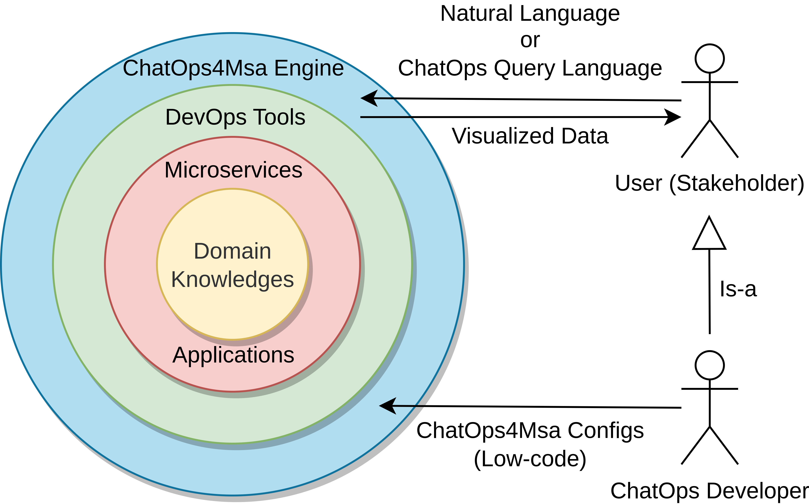
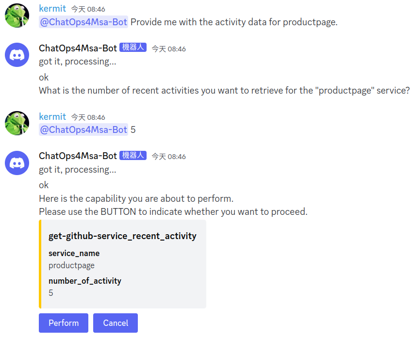
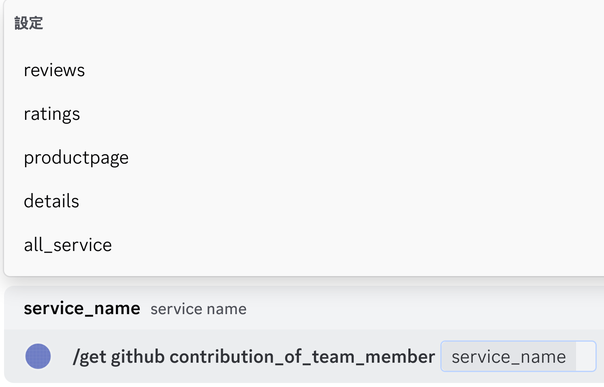
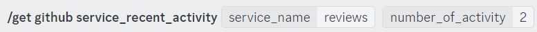

# ChatOps4Msa

> ChatOps for Microservices Architecture - ChatOps4Msa

ChatOps4Msa is a Conversational Assistant Tool designed for Microservices Development and Operations, utilizing Large Language Models (LLMs). Users can monitor real-time service status, perform automated actions like tests and code scanning, and receive alert notifications using a designed query language called CQL (ChatOps Query Language) or natural language.

Developers can customize desired functionalities using Low-code configuration files, which distinguishes it from traditional chatbot development that often requires extensive training data. Leveraging state-of-the-art Large Language Models, ChatOps4Msa analyzes user queries to determine intent and entities, enabling corresponding actions.

Here is the scenario of ChatOps4Msa:

<div></div>

<br />
<br />

Here is the operation concept of ChatOps4Msa:

<div></div>

## How to Use

### Natural Language

In the chatops channel, use `@ChatOps4Msa-Bot` to mention ChatOps4Msa, then input your request in natural language.

<div></div>

### CQL (ChatOps Query Language)

In the chatops channel, directly execute commands using slash commands that start with `/`.

<div></div>

<br />
<br />

And here is the syntax of CQL:

```
[ACTION] [TOOL] [COMMAND] [SERVICE] [FLAGS]
```

<div></div>

<br />
<br />

| PARAMETER | DESCRIPTION                                                                                                                                                                                                   | REQUIRED? |
| --------- | ------------------------------------------------------------------------------------------------------------------------------------------------------------------------------------------------------------- | --------- |
| [ACTION]  | The actions to be performed, such as retrieving information (get), configuring settings (set), monitoring services (monitor), testing services (test), and so on.                                             | required  |
| [TOOL]    | The tools to be used, such as GitHub, Prometheus, k6, custom modules, and so on.                                                                                                                              | required  |
| [COMMAND] | The operations to be executed, such as `service_recent_activity`.                                                                                                                                             | required  |
| [SERVICE] | The target service for execution, which can be selected as `all_service` to include all services.                                                                                                             | optional  |
| [FLAGS]   | Additional parameter options, which can be multiple; all CQL commands include the `subscribe` parameter for scheduling periodic executions of the function, with the parameter value being a Cron expression. | optional  |

<!-- TODO ==========================================================================================

## Try ChatOps4Msa

- demo capability
- demo video
- dc channel online demo

- deploy
  - secret.yml
  - application.properties
- custom-capability
  - low-code

## Feature

- goal
- low-code (service composition)
- llm (with dst)
- comparison (ChatOps4Msa vs. other ChatOps Tools) -->
