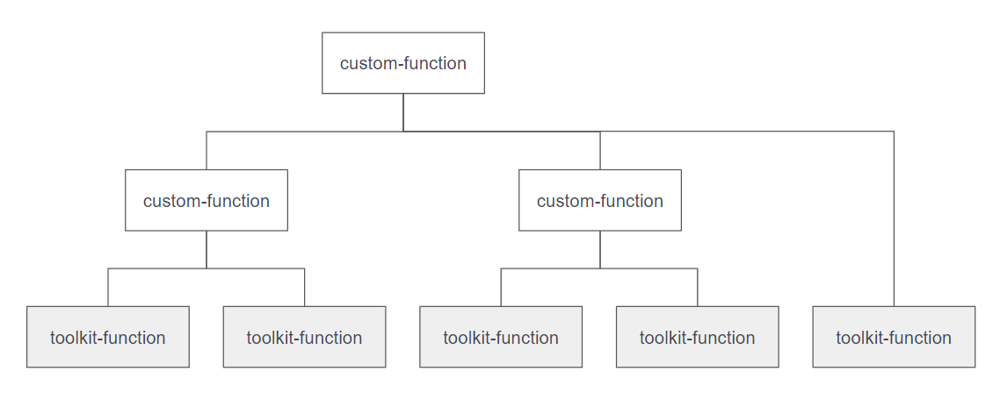

# Feature

## Goal

The distributed nature of microservices architecture increases complexity in development and operations. The introduction of various types of DevOps tools also raises challenges for development teams and stakeholders to comprehend the system's current state. Due to the lack of a comprehensive integration pattern and user interface, information needs to be gathered from multiple sources.

However, applying common ChatOps mechanisms to microservices architecture presents several issues:

- Developers struggle to easily customize required capabilities.
- Acquiring natural language processing capabilities requires collecting and writing extensive training data.
- Executing capabilities on different calling interfaces of DevOps tools is cumbersome.
- Parallel operations across various services in a microservices system are difficult.

To address these challenges, we designed ChatOps4Msa, which aims to provide solutions. Below is the design of the core engine of ChatOps4Msa:

## Service Composition by Low-code

We've integrated the concepts of service composition and Low-code to create [a Low-code style configuration file](./custom_capability.md). Developers can effortlessly leverage our provided [toolkit-function](./capability-guideline/toolkit_list.md) to access capabilities from DevOps tools and manipulate data. They can then combine these `toolkit-functions` to craft customized capabilities, which we refer to as `custom-function`. Moreover, the ability to further combine `custom-functions` allows for the design of more sophisticated capabilities, streamlining the development process.

| FUNCTION         | DESCRIPTION                                                                                                                                                                                                         |
| ---------------- | ------------------------------------------------------------------------------------------------------------------------------------------------------------------------------------------------------------------- |
| toolkit-function | These are the foundational assembly components offered by ChatOps4Msa, which are not accessible for direct execution by users. Developers can utilize these components to construct all the necessary capabilities. |
| custom-function  | These are the custom operations assembled by developers, available for users to execute, or further assembled with other toolkit functions or external custom functions to create more powerful capabilities.       |

## LLM (Large Language Model) and DST (Dialogue State Tracker)

In order to reduce the workload of developers, we have designed a natural language processing workflow that integrates with OpenAI's large language model. This workflow analyzes the functional intent and parameter entities of user's natural language queries and executes corresponding actions, achieving `zero-shot learning`. The system automatically injects service information and capability details into the language model's prompts and enhances recognition accuracy through `In-context Learning.`

 
 

_See [all prompt tempaltes](../src/main/resources/prompts)._

 
 

## Comparison

> ChatOps4Msa vs. other ChatOps Tools

|                                         | Hubot                       | GitLab ChatOps                                                     | Amazon Lex                                            | ChatOps4Msa                                                                                             |
| --------------------------------------- | --------------------------- | ------------------------------------------------------------------ | ----------------------------------------------------- | ------------------------------------------------------------------------------------------------------- |
| Developing New Capabilities             | CoffeeScript                | CI/CD Jobs                                                         | Lambda Functions                                      | Low-Code Configuration Files (Supports Service Composition)                                             |
| Capabilities Scope                      | Unlimited                   | Limited to GitLab                                                  | Limited to AWS                                        | Unlimited                                                                                               |
| Calling Different Tool Interfaces       | Requires Custom Programming | Use Scripts to Call                                                | Requires Custom Programming                           | Can Use Various Toolkits to Call REST APIs, Bash Commands, etc.                                         |
| Combining Different Tool Capabilities   | Requires Custom Programming | Sequential Script Calls, but can't Directly Pass Process Variables | Requires Custom Programming                           | Can Use Toolkits for Composition, Allowing Complex Operations like Variable Passing, Flow Control, etc. |
| Parallel Execution on Multiple Services | Not Supported               | Not Supported                                                      | Requires Custom Programming                           | Can Use Toolkits to Combine with Docker, Run Multiple Containers for Multiprocessing.                   |
| Operation Mode                          | Command-based               | Command-based                                                      | Command, Natural Language, or Speech                  | Command or Natural Language (No need for Training Data)                                                 |
| Operation with Natural Language         | Not Supported               | Not Supported                                                      | Prepare Training Data, Train Model Using AWS Platform | Directly Use Large Language Model as Pre-trained Model to Assist Natural Language Processing Workflow.  |